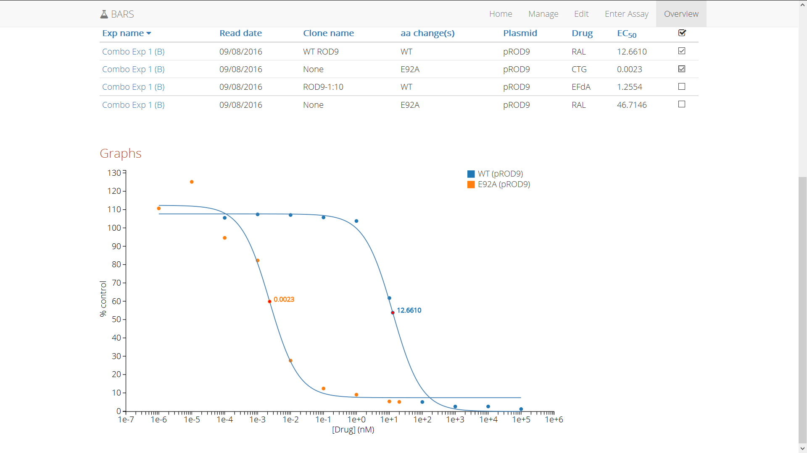
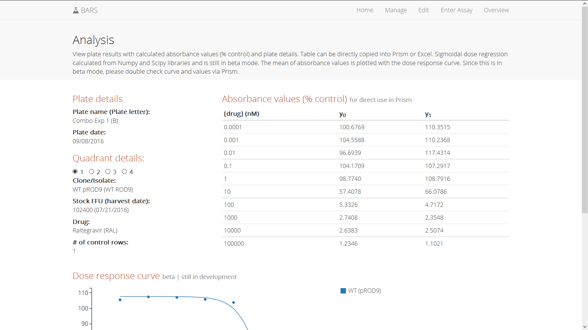

# Biological Assay Record System (BARS)
BARS is an open-source and full-stack tool for workflow management with single-cycle drug susceptibility assays. This system will manage plasmid clones, virus stocks, drugs, and plate readings (from the Victor plate reader).

## Features
- Manage complete workflow from the creation of plasmid clones to harvested virus stock to absorbance reading
- Visualize dose response curves
- Generate 50% effective concentration values (EC50 value)
- Compare different dose response curves across different experiments

## Screenshots
Index page

Overview pages

Enter assay page

Analysis pages

Manage page

